# wafkali
WAF, Kali, Nikto, OWASP

## Objective
To simulate an attack (directory traversal) using Nikto.
To setup (install & configure) Apache2 web server, ModSecurity & OWASP CRS [Core Rule Set].

## Web Application Firewall 

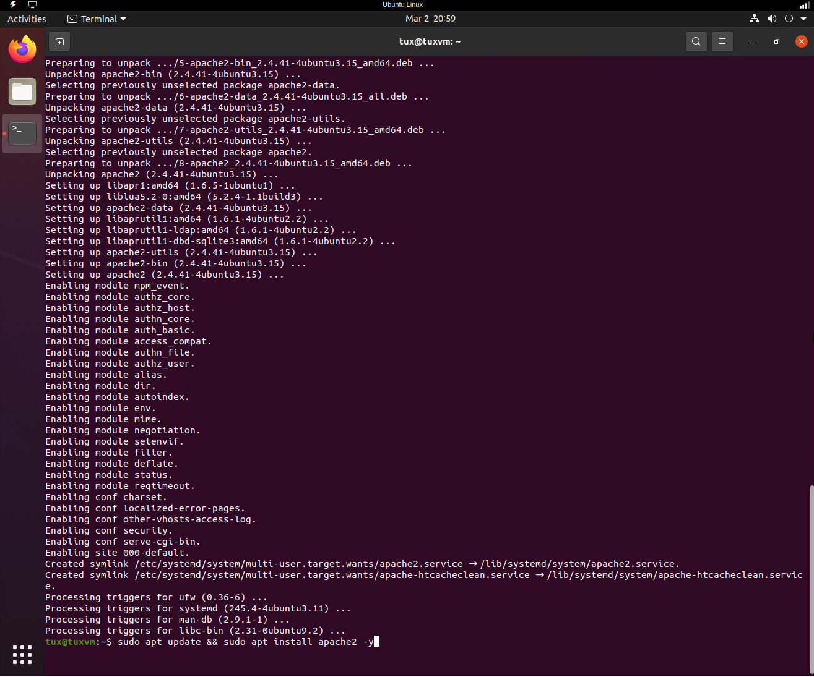

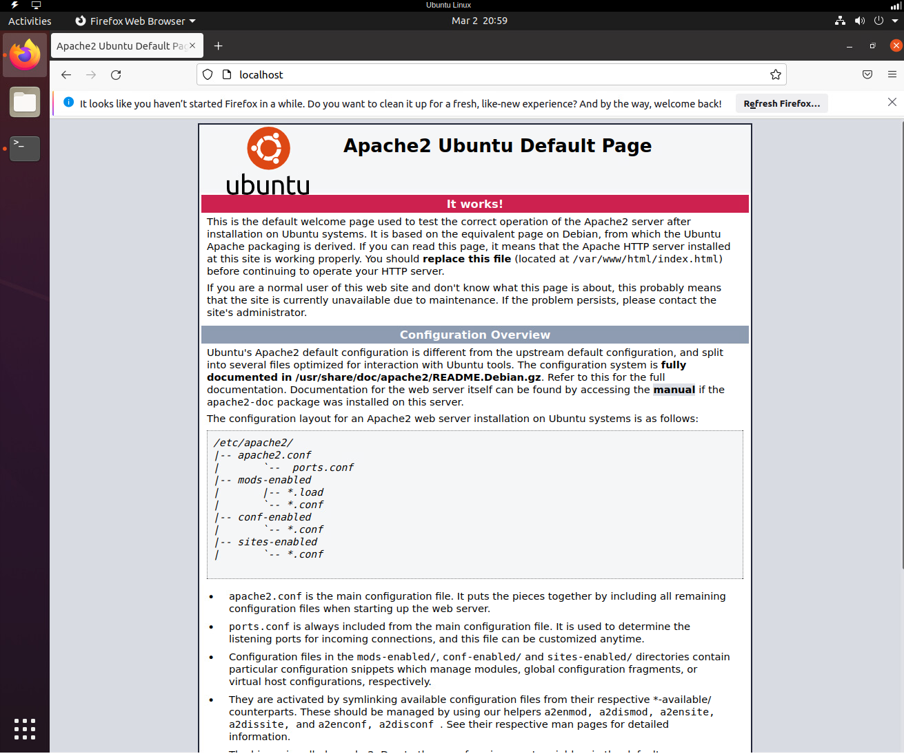

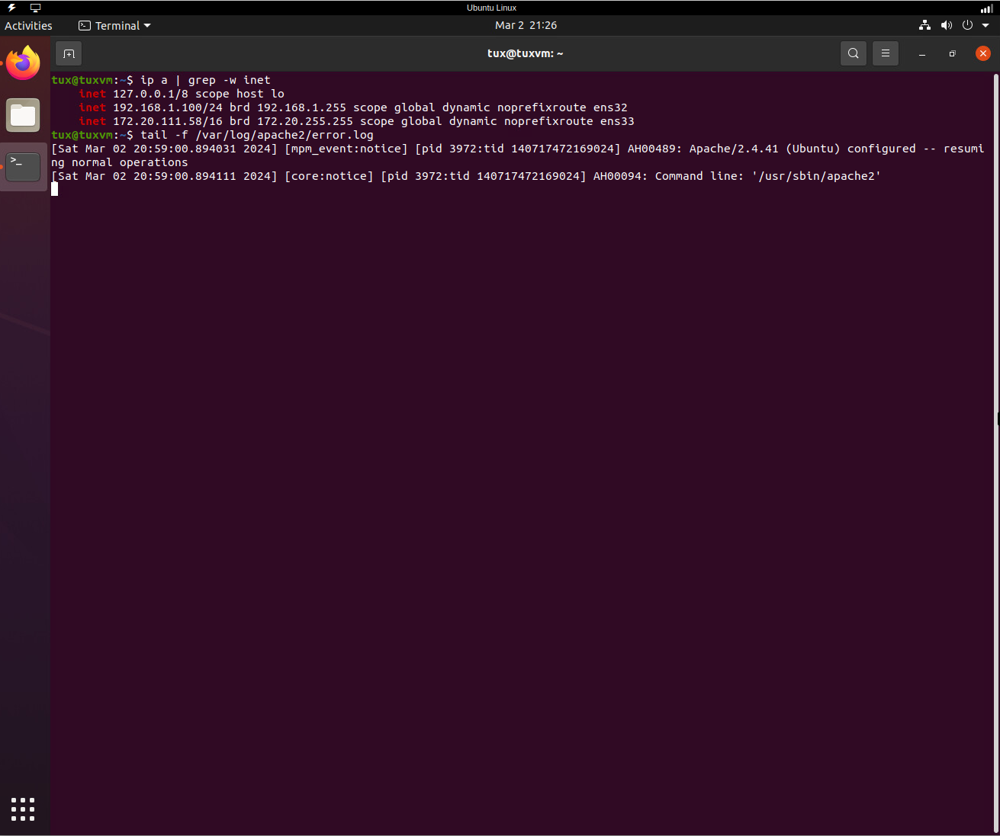

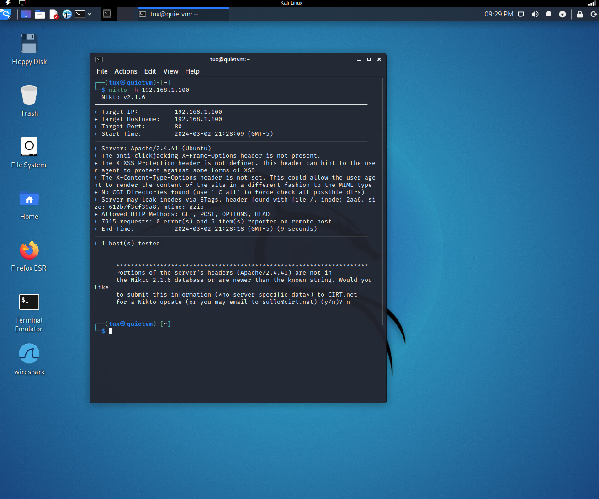

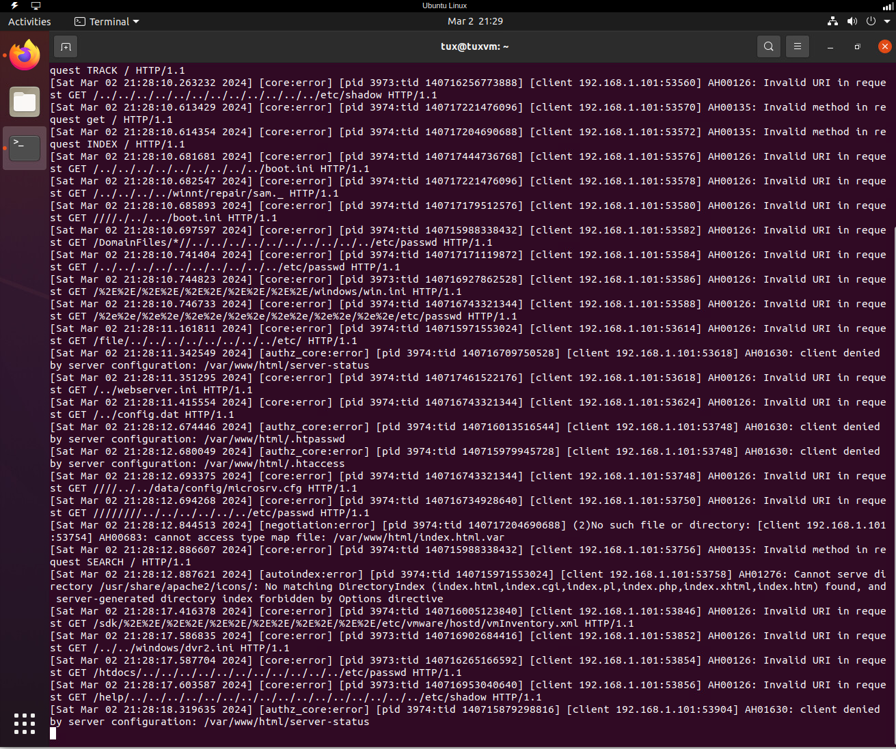

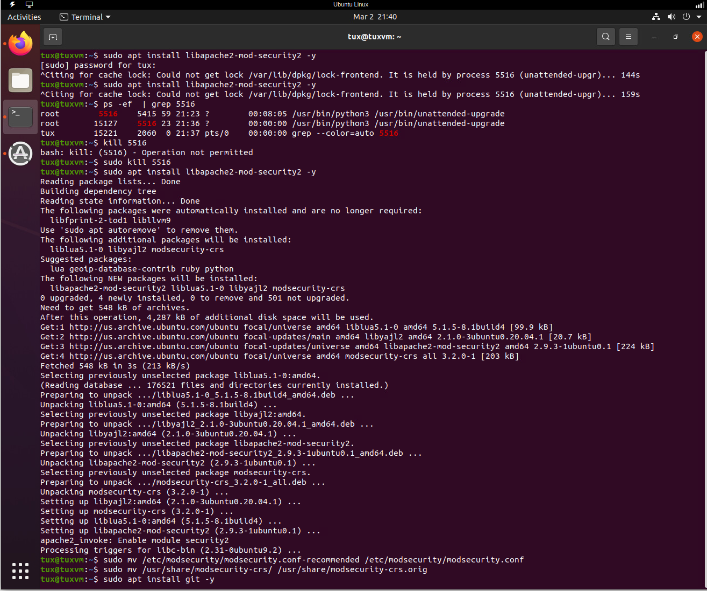

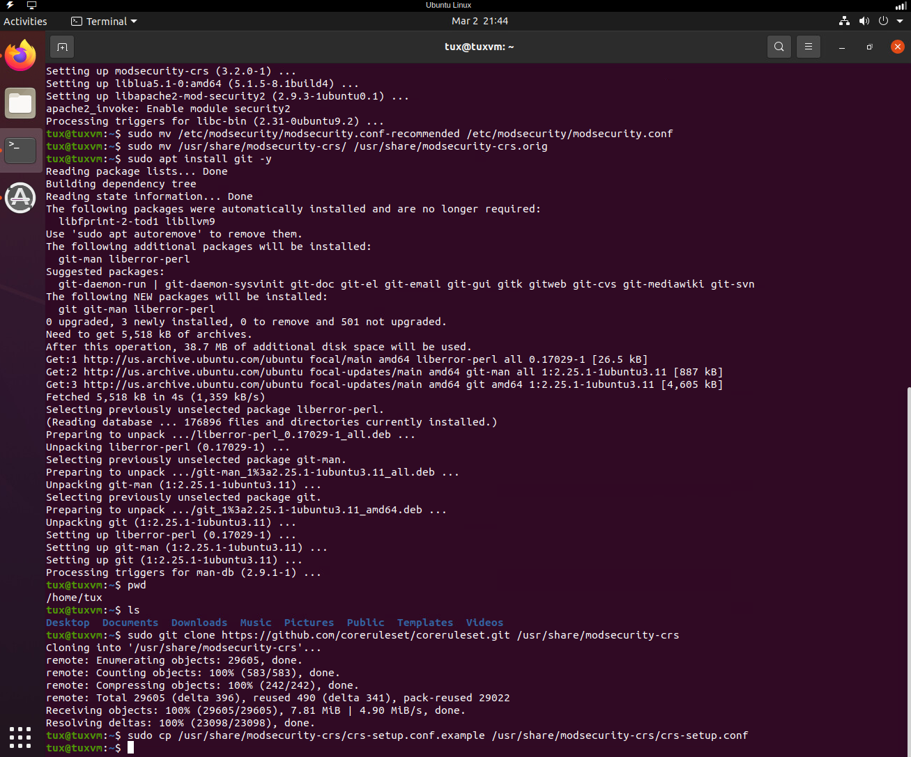

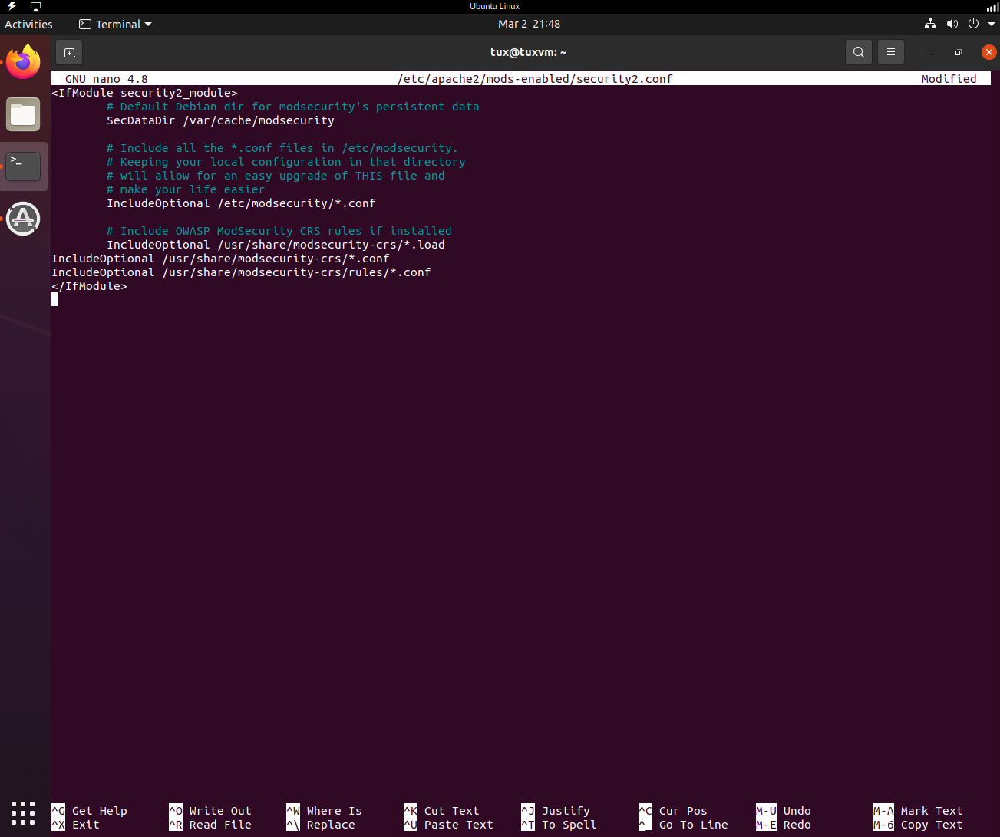

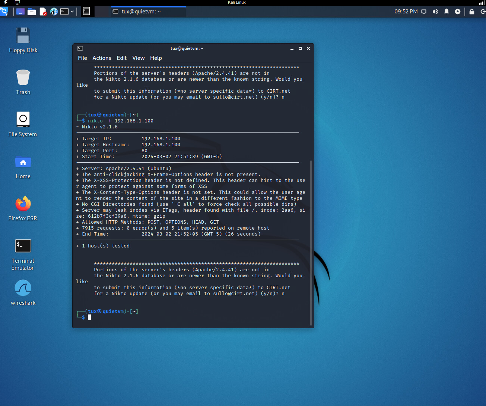

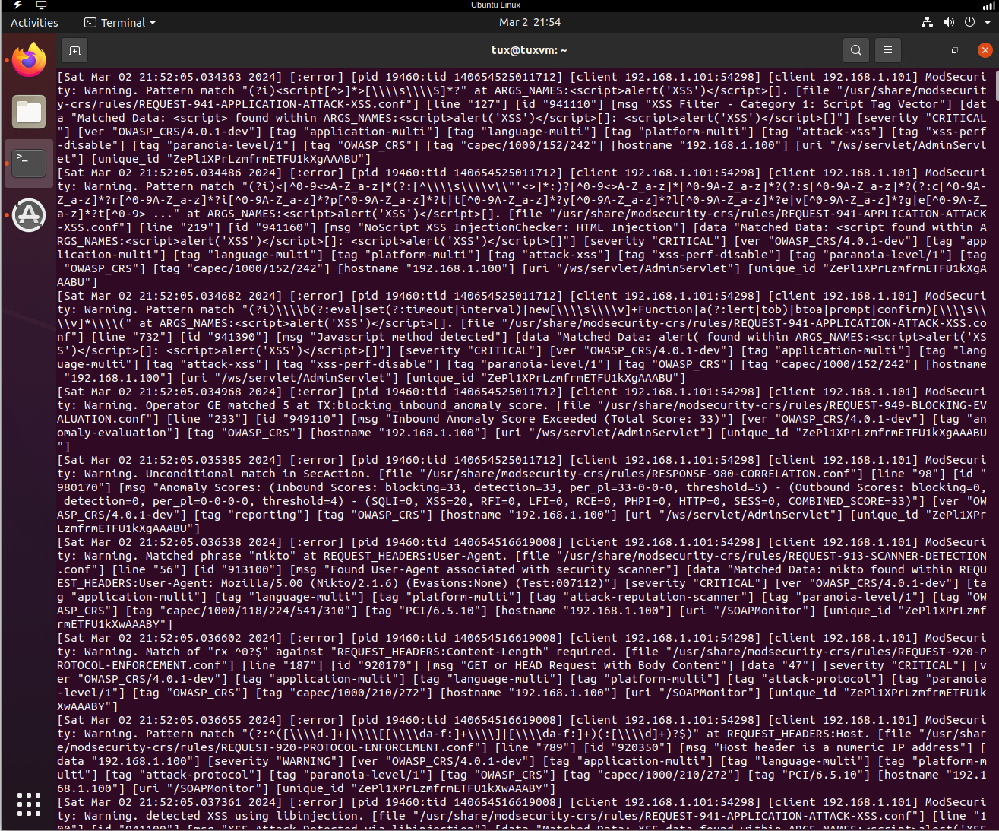

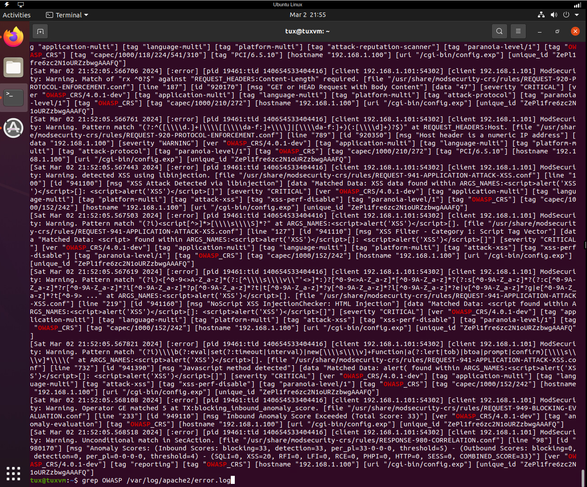
